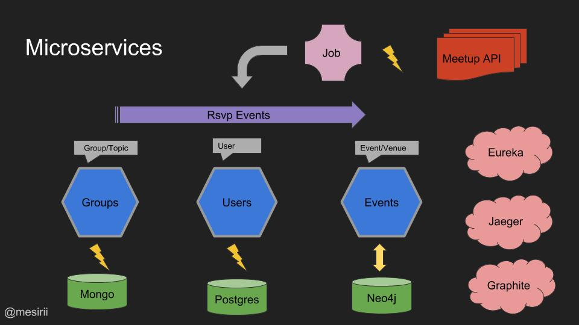
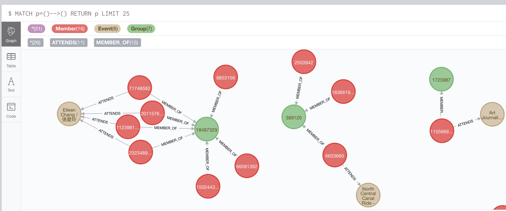
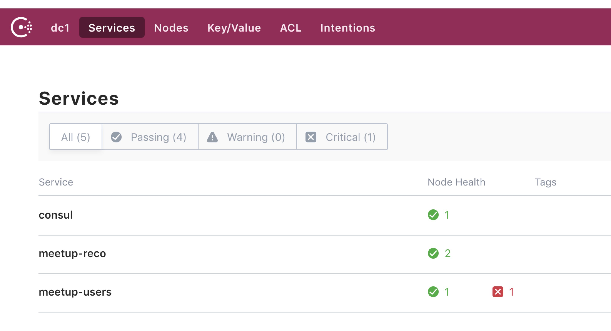
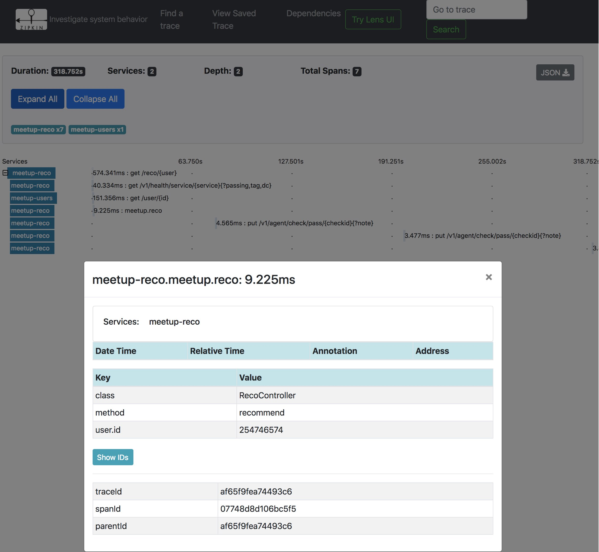

== Meetup Recommendation Engine with Micronaut Federated Services

Presentation: https://www.dropbox.com/s/57luj0qyg2swjaz/Ad%20Astra%20with%20Micronaut.pdf?dl=0[Ad Astra with Micronaut (pdf)]

=== Resources:

* https://docs.micronaut.io/snapshhot/guide/index.html[Micronaut Docs]
* https://guides.micronaut.io/[Guides] (e.g. for cloud integrations, databases)
* My articles - https://medium.com/@mesirii/ad-astra-the-micronaut-framework-52ff2d684877[part 1], https://medium.com/@mesirii/cloud-native-with-micronaut-733c9784850f[part 2]
* https://github.com/JonasHavers/awesome-micronaut[Awesome Micronaut]
* https://medium.com/@jonashavers/getting-started-with-micronaut-595515985a98[Micronaut Getting Started]
* https://alvarosanchez.github.io/micronaut-workshop/[Micronaut Workshop]
* InfoQ series (https://www.infoq.com/articles/micronaut-tutorial-microservices-jvm[part 1], https://www.infoq.com/articles/micronaut-tracing-security-serverless[part 2])

== Hello World

----
sdk install java 1.0.0-rc-13-grl
sdk install micronaut
mn help

mn create-app test
cd test
mn create-service hello

# edit HelloController.java and add

cat << EOF
@Get ("/echo/{text}")
public Single<String> echo(String text) {
    return Single.just(">" + text);
}
EOF

./gradlew run
# or
./gradlew assemble && java -jar build/libs/test-all-0.1.0.jar

curl "http://localhost:8080/hello/echo/Hello%20World"

ab -n5000 -c2 http://localhost:8080/hello/echo/test

# Docker Build
docker build -t "test" .
docker run -p 8080:8080 test:latest
----

== Native Image

----
mn create-app graal-test --features graal-native-image
cd graal-test
mn create-controller hello

./build-native-image.sh 

# Writing reflect.json file to destination: build/reflect.json
# [graal-test:96082]    classlist:   3,493.79 ms
# ...
# Warning: class initialization of class io.netty.handler.ssl.JettyNpnSslEngine failed …
# ...
# [graal-test:96082]        write:   1,606.12 ms
# [graal-test:96082]      [total]:  81,785.20 ms

./graal-test
----

== Demo Application

* Federated Set of MicroServices
* Async Fetch from Meetup-RSVP
* Send to Kafka
* Members in Postgres (reactive)
* Events & RSVP in Neo4j
* Groups & Topics in Mongo
* Member, Group, Recommendation-Services
* Discovery, Config, Tracing, Monitoring, Resiliency

Run infrastructure via `docker-compose` 

link:./docker-compose.yml[]

== Receiving Stream and Send to Kafka

Meetup Rsvp Streaming API: https://stream.meetup.com/2/rsvps

.example payload
[source,javascript]
----
{ "response": "yes","guests": 0,
  "rsvp_id": 1777141786,"mtime": 1552816747573,"visibility": "public",
  "venue": {
  	"venue_name": "4518 Innovation Dr","lon": -105.04565,"lat": 40.524513,"venue_id": 26220190
  },
  "member": {
  	"member_id": 195627132,"member_name": "Brandon"
  },
  "event": {
  	"event_name": "Rocky Mountain Archery!","event_id": "259473580","time": 1553216400000,
  	"event_url": "https:\/\/www.meetup.com\/NoCo-Active-Introverts\/events\/259473580\/"
  },
  "group": {
  	"group_topics": [{"urlkey": "camping","topic_name": "Camping"}],
  	"group_id": 30952408,
  	"group_name": "NoCo Active Introverts",
  	"group_city": "Fort Collins","group_state": "CO","group_country": "us",
  	"group_lon": -105.11,"group_lat": 40.58
  }
}
----

|===
| Task | Command
| Create a bunch of DTOs to hold the data
| auto-transformation from JSON
| Create an (reactive) HTTP client for the meetup API
m| mn create-client rsvp
| Create an Controller (for testing) that 
m| mn create-controller rsvp
| Create a Kafka Producer to send events to a topic
m| mn create-bean rsvp-source
| Create a scheduled Job to receive events and send to kafka
m| mn create-job rsvp
|===

.declarative HTTP client
[source,java]
----
@Client("${app.meetup-url}")
@CircuitBreaker(reset = "30s")
public interface RsvpClient {

    @Get("/rsvps")
    public Flux<Rsvp> index();
}
----

[source,java]
----
@KafkaClient(batch=true)
public interface RsvpProducer {
    @Topic("rsvps")
    void sendRsvp(List<Rsvp> rsvps);
}
----

[source,java]
----
@Singleton
public class RsvpJob {
    @Inject RsvpClient client;
    @Inject RsvpSource source;
	
    @Scheduled(fixedRate = "5s")
    public void process() {
       client.index()
	   .doOnNext(r -> source.send(r.rsvp_id, r));
    }
}
----

----
kafkacat -C -b broker:9092 -t rsvps -c 10
----

== Storage

* add feature flags for storage
** neo4j, mongo, postgres, jpa, redis, gorm, ...
* consume and store filtered events from Kafka in Listeners
* use reactive APIs where available
* additional controllers to provide data to clients

* users into Postgres
* groups into MongoDB
* rsvp and event into Neo4j

=== MongoDB

----
mn create-app meetup-groups --features mongo-reactive,kafka
----

.MongoDB Listener
----
@KafkaListener(offsetReset = OffsetReset.EARLIEST)
public class GroupListener {
	
    private final MongoClient mongoClient;

    @Topic("rsvps")
    public Mono<Success> receiveRsvp(
                   @KafkaKey String id, Mono<Rsvp> rsvp) {
        return rsvp.flatMap(r -> 
          Flux.from(getCollection().insertOne(r.group)).next());
    }
}
----

=== Postgres

TODO

=== Neo4j

----
mn create-app meetup-reco --features neo4j-bolt,kafka
----

[source,cypher]
----
MERGE (e:Event {id:$rvsp.event.id}) ON CREATE SET e.time = $rsvp.event.time
MERGE (g:Group {id:$rspv.group.id})
MERGE (u:User  {id:$rspv.user.id})
MERGE (u)-[:MEMBER_OF]->(g)
MERGE (u)-[:ATTENDS]->(e);
----

[source,java]
----
@KafkaListener(offsetReset = OffsetReset.EARLIEST)
public class RsvpListener {
	
  @Inject Driver driver;

  static String STATEMENT = "MERGE (e:Event {id:$rsvp.event_id}";
	
  @Topic("rsvps")
  public Mono<Integer> receive(@KafkaKey String id, Mono<Rsvp> rsvp) {
	    Session s = driver.session();
        return rsvp.map(r -> s.writeTransaction(tx ->tx.run(STATEMENT,
      parameters("rsvp",params(r))).consume().counters().nodesCreated()));
    }
}
----

== Recommendation

[source,cypher]
----
MATCH (u:User {id:$id})-[:ATTENDS]->()<-[:ATTENDS]-(u2:User)
// Most similar peers
WITH u, u2, count(*) as sameEvent ORDER BY sameEvent DESC LIMIT 20
// their future events
MATCH (u2)-[:ATTENDS]->(e:Event)
WHERE e.time > timestamp() AND NOT (u)-[:ATTENDS]->(e)
// top ranked events
RETURN e.id as event_id, count(*) as eventFreq
ORDER BY eventFreq DESC LIMIT 10;
----

.Testing the service
[source,bash]
----
curl http://localhost:8084/reco/193808772 | jq .
[{"event_name": "Meet new friends with a Graduate Degree!
                 (35 - 59) (FREE DRINK/HOSTED)",
  "event_id": "259791109",
  "time": 1553277600000
},{"event_name": "11-Day Adventure to Quito & The Galapagos 
                  Islands - 29th March 2019",
    "event_id": "258058813",
    "time": 1553886000000
  },

----

=== CLI App

TODO

== Cloud Native

=== Discovery & Configuration

Discovery with Consul

All applications are registered by their name at startup and deregistered at shutdown.

They are automatically looked up by named client `@Client("myservice")` or ApplicationContext/Injection.

Also integrate in health endpoint and metrics.

----
docker run -p 8500:8500 consul 
----

[source,yaml]
----
consul:
  client:
    registration:
      enabled: true
    defaultZone: "${CONSUL_HOST:localhost}:${CONSUL_PORT:8500}"
----

[source,java]
----
@Client("meetup-users")
public interface UserClient {

    @Get("/user/{id}")
    public Single<Member> member(Integer id);
}
----

[source,java]
----
@Inject UserClient users;

users.member(user).map( m -> ...);
----

Configuration `"${my.conf.some-value}"` injected from config, or config server.

----
app:
    meetup-url: https://stream.meetup.com/2/   
----

=== Resiliency

Using `@CircuitBreaker` on remote clients.

[source,java]
----
@Client("${app.meetup-url}")
@CircuitBreaker(reset = "30s")
public interface RsvpClient {

    @Get("/rsvps")
    public Flux<Rsvp> index();
}
----

=== Monitoring

Enable management with `--features management`

----
endpoints:
    health:
        enabled: true
# relax security only for demo
        sensitive: false
        details-visible: ANONYMOUS
    beans:
        enabled: true
        sensitive: false
----

That also enables health endpoint which is a composite set  of health-indicators whose compound status determines the healt-status.

Example: DOWN <= UP + UP + DOWN + UP

----
curl http://localhost:8083/health | jq .

{
  "name": "meetup-users",
  "status": "DOWN",
  "details": {
    "postgres-reactive": {
      "name": "meetup-users",
      "status": "UP",
      "details": {
        "version": "PostgreSQL 11.2 (Debian 11.2-1.pgdg90+1) on x86_64-pc-linux-gnu, compiled by gcc (Debian 6.3.0-18+deb9u1) 6.3.0 20170516, 64-bit"
      }
    },
    "compositeDiscoveryClient(consul)": {
      "name": "meetup-users",
      "status": "UP",
      "details": {
        "services": {
          "meetup-users": [
            "http://localhost:8083"
          ],
          "meetup-reco": [
            "http://localhost:8084"
          ],
          "consul": [
            "http://localhost:8500"
          ]
        }
      }
    },
    "diskSpace": {
      "name": "meetup-users",
      "status": "UP",
      "details": {
        "total": 2000796545024,
        "free": 1460165070848,
        "threshold": 10485760
      }
    },
    "kafka": {
      "name": "meetup-users",
      "status": "DOWN",
      "details": {
        "brokerId": "1",
        "clusterId": "aW-uv1gkTymlMwcjHnHpSA",
        "nodes": 1
      }
    },
    "consul": {
      "name": "meetup-users",
      "status": "UP",
      "details": {
        "leader": "\"127.0.0.1:8300\"\n"
      }
    }
  }
}
----

=== Tracing

Enable tracing `--features tracing-zipkin`

----
docker run -p "9411:9411" openzipkin/zipkin
----

It is  only sampled at a low rate, if you want to see it in a demo you have to increase the probability.

[source,yaml]
----
tracing:
    zipkin:
        enabled: true
        http:
            url: http://localhost:9411
        sampler:
            probability: 1
----

Then you can annotate (for additional metadata) methods and parameters with annotations to create `@NewSpan` or continue `@ContinueSpan` spans, parameters can be transferred to the tracing with `@SpanParam`.

[source,java]
----
@Get("/{user}")
@NewSpan("meetup.reco")
public Flowable<Event> recommend(@SpanTag("user.id") Integer user) {
    return
    users.member(user).flatMapPublisher(m -> 
      Flowable.fromIterable(driver.session().run(RECO_STATEMENT, Values.parameters("id",user)).list()).map(this::event).map(e -> e.withMember(m)));
}
----

////
NOTES

micronaut presentation

- what is the story?

√ - theme ? space+small ? -> comets, pluto, how does the solar system move through the universe, thule, hubble, voyager, moon

√ - why yet another java application framework - history
TODO MORE - design considerations for micronaut
- my personal impressions
√ - wth is cloud native !?
√ - 12factor
- main areas
- injection + compile time
- startup time + size
- reactive
√ - http server/client -> can even share an interface
√ - cloud native (orchestration/lookup, monitoring, tracing, )

- streaming data (kafka)

- need to add circuit breaker
- isolation layer from meetup's API
- as an example, only load "yes" rsvps into our system

mn create-app meetup-users --features kafka,postgres-reactive

- show health + monitoring endpoints

mn create-app test-all-java --profile service --features annotation-api,cassandra,hibernate-gorm,hibernate-jpa,jdbc-dbcp,postgres-reactive,redis-lettuce,mongo-gorm,mongo-reactive,neo4j-bolt,neo4j-gorm,kafka,kafka-streams,rabbitmq,management,config-consul,discovery-consul,discovery-eureka,graal-native-image,java,http-client,http-server,jib,micrometer,micrometer-graphite,netflix-archaius,netflix-hystrix,netflix-ribbon,picocli,security-jwt,junit,spek,springloaded,jrebel,swagger-java,tracing-jaeger,tracing-zipkin

curl localhost:8080/rsvp/users -d '{"name":"John","age":32}' -H content-type:application/json

curl localhost:8081/rsvp/groups -d '{"id":124, "name":"Micronaut","topics":["frameworks","java","cloud"]}' -H content-type:application/json

{"message":"Internal Server Error: An exception occurred when encoding using the AutomaticPojoCodec.\nEncoding a Group: 'meetup.groups.Group@675f8453' failed with the following exception:\n\nUnable to get value for property 'group_city' in Group\n\nA custom Codec or PojoCodec may need to be explicitly configured and registered to handle this type."}

compile 'io.micronaut:micronaut-management'
curl -i http://localhost:8082/health
HTTP/1.1 503 Service Unavailable
Date: Mon, 18 Mar 2019 21:12:45 GMT
content-type: application/json
content-length: 656
connection: close

{"name":"meetup-users","status":"DOWN","details":{"postgres-reactive":{"name":"meetup-users","status":"UP","details":{"version":"PostgreSQL 11.2 (Debian 11.2-1.pgdg90+1) on x86_64-pc-linux-gnu, compiled by gcc (Debian 6.3.0-18+deb9u1) 6.3.0 20170516, 64-bit"}},"compositeDiscoveryClient()":{"name":"meetup-users","status":"UP"},"diskSpace":{"name":"meetup-users","status":"UP","details":{"total":2000796545024,"free":1480417976320,"threshold":10485760}},"kafka":{"name":"meetup-users","status":"DOWN","details":{"error":"java.util.concurrent.ExecutionException: org.apache.kafka.common.errors.TimeoutException: Timed out waiting for a node assignment."}}}}

- each of the microservices consumes RSVP events from the stream
  - you could filter/alter/enrich them withing the Kafka infrastructure

- stores the relevant domain entity in it's data storage
- provides REST/GraphQL APIs to make them available to front/end or other services
- offer value added services
- for example event recommendations for a user

MERGE (e:Event {id:$rvsp.event.id}) ON CREATE SET e.time = $rsvp.event.time
MERGE (g:Group {id:$rspv.group.id})
MERGE (u:User  {id:$rspv.user.id})
MERGE (u)-[:MEMBER_OF]->(g)
MERGE (u)-[:ATTENDS]->(e);

MATCH (u:User {id:$id})-[:ATTENDS]->()<-[:ATTENDS]-(u2:User)
WITH u2, count(*) as freq ORDER BY freq DESC LIMIT 20
MATCH (u2)-[:ATTENDS]->(e:Event)
WHERE e.time > timestamp()
RETURN e.id as event_id
ORDER BY count(*) DESC LIMIT 10;

// todo if not exists postgres
INSERT INTO USER values(user_id, ....);
INSERT INTO USER_GROUPS values(user_id, group_id);

Groups into mongo

group + topics + venues

- containers / aot

- example

- meetup.com -> website, show of hands, what is it, domain
- rsvp streaming http endpoint -> our starting point
- reactive consumer -> store as events in Redis?
- send events to other services
- group service: group, events
- member service: people, interests
- recommendation service -> rsvps, topology

== Meetup Recommendations with Micronaut

I want to show hands-on how to use the impressive list of cloud-native features that Micronaut offers in a practical scenario also demonstrating the simple programming model, well designed APIs and fast startup time.

- what is Micronaut
- when would I use it
- what features are available for cloud native microservices and functions
- how would I use them in practise

req:
Some experiences with building backend applications. 
JVM experience would be helpful but not required.

abstract:
In an active open-source community, Meetups play an important part of pulling people interested in a tech topic together and foster exchange of ideas. In this talk, I want to show how to use Micronaut to build a fully federated solution based on the streaming RSVP API of meetup.com. We ingest the RSVP events with the reactive http client and make it available to our system via Kafka. To demonstrate the polyglot functionality in our event-sourced system, we will store events in Redis, members and groups in Postgres, and meetups and attendance in Neo4j.
Each service can make its data available via reactive APIs, and on top of that, we're providing meetup recommendations for members with the built-in Neo4j integration.
As a proper "cloud-native" application, we use Micronauts integrations for orchestration, tracing, monitoring while making sure that we are not affected by outages of our dependent APIs using CircuitBreakers and Retries.
I hope that the talk gives you enough hands-on experience for building your own Micronaut-based applications.

Note:

This is a more practical talk that shows how to apply the built-in cloud-native features that Micronaut brings to the table.
I've been interacting with the Micronaut Team at OCI since the early days of the framework in the beginning of 2018.

I already published two print articles about the topic (in German) which are available in English here:

* https://medium.com/@mesirii/ad-astra-the-micronaut-framework-52ff2d684877
* https://medium.com/@mesirii/cloud-native-with-micronaut-733c9784850f

////